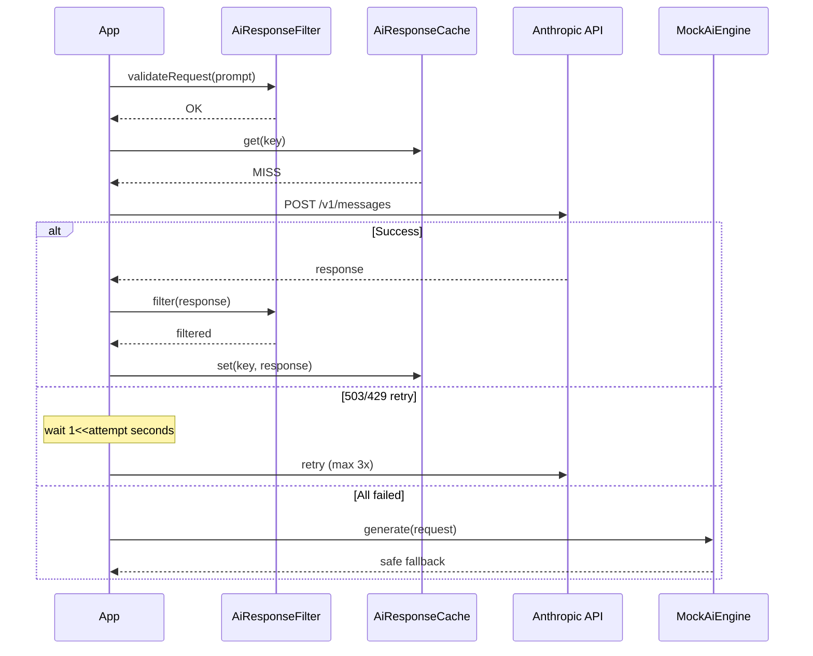

# AI Provider Flow

```mermaid
sequenceDiagram
    participant App
    participant Filter as AiResponseFilter
    participant Cache as AiResponseCache
    participant API as Anthropic API
    participant Mock as MockAiEngine

    App->>Filter: validateRequest(prompt)
    Filter-->>App: OK
    App->>Cache: get(key)
    Cache-->>App: MISS
    App->>API: POST /v1/messages
    alt Success
        API-->>App: response
        App->>Filter: filter(response)
        Filter-->>App: filtered
        App->>Cache: set(key, response)
    else 503/429 retry
        Note over App: wait 1<<attempt seconds
        App->>API: retry (max 3x)
    else All failed
        App->>Mock: generate(request)
        Mock-->>App: safe fallback
    end
```
