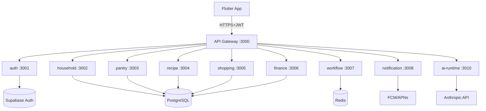

# Backend Architecture

```mermaid
graph TD
    Client[Flutter App] -->|HTTPS+JWT| GW[API Gateway :3000]
    GW --> AUTH[auth :3001]
    GW --> HH[household :3002]
    GW --> PT[pantry :3003]
    GW --> RC[recipe :3004]
    GW --> SH[shopping :3005]
    GW --> FN[finance :3006]
    GW --> WF[workflow :3007]
    GW --> NT[notification :3008]
    GW --> AIR[ai-runtime :3010]
    AUTH --> SB[(Supabase Auth)]
    HH & PT & RC & SH & FN --> PG[(PostgreSQL)]
    WF --> RD[(Redis)]
    NT --> FCM[FCM/APNs]
    AIR --> ANT[Anthropic API]
```
