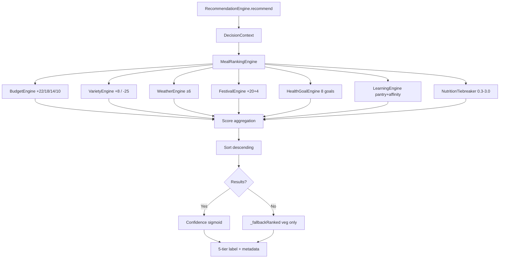

# Decision Engine Flow

```mermaid
graph TD
    A[RecommendationEngine.recommend] --> B[DecisionContext]
    B --> C[MealRankingEngine]
    C --> D[BudgetEngine +22/18/14/10]
    C --> E[VarietyEngine +8 / -25]
    C --> F[WeatherEngine ±6]
    C --> G[FestivalEngine +20+4]
    C --> H[HealthGoalEngine 8 goals]
    C --> I[LearningEngine pantry+affinity]
    C --> J[NutritionTiebreaker 0.3-3.0]
    D & E & F & G & H & I & J --> K[Score aggregation]
    K --> L[Sort descending]
    L --> M{Results?}
    M -- Yes --> N[Confidence sigmoid]
    M -- No --> O[_fallbackRanked veg only]
    N --> P[5-tier label + metadata]
    O --> P
```
