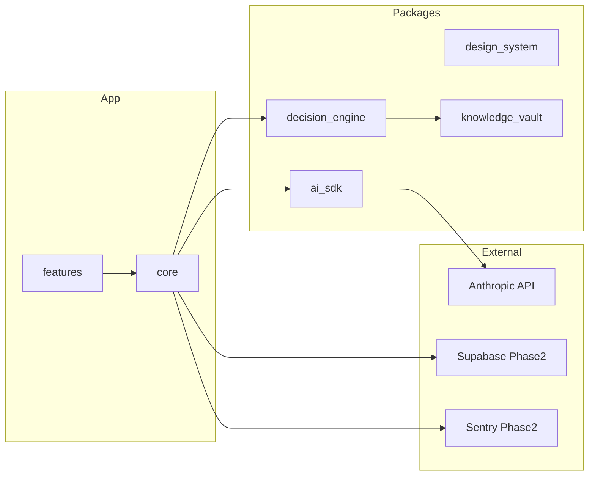

# Dependency Graph

```mermaid
graph LR
    subgraph External
        ANT[Anthropic API]
        SP2[Supabase Phase2]
        SEN[Sentry Phase2]
    end
    subgraph App
        CORE[core]
        FEAT[features]
    end
    subgraph Packages
        DS[design_system]
        KV[knowledge_vault]
        DE[decision_engine]
        AI[ai_sdk]
    end
    FEAT --> CORE
    CORE --> DE & AI
    DE --> KV
    AI --> ANT
    CORE --> SP2
    CORE --> SEN
```
