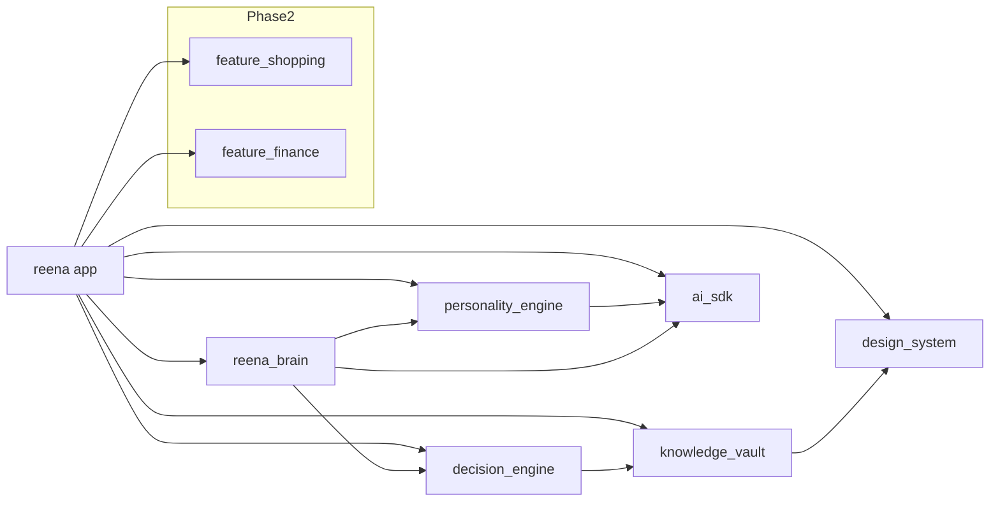

# Package Dependencies

```mermaid
graph LR
    APP[reena app] --> DS[design_system]
    APP --> KV[knowledge_vault]
    APP --> DE[decision_engine]
    APP --> AI[ai_sdk]
    APP --> PE[personality_engine]
    APP --> RB[reena_brain]
    KV --> DS
    DE --> KV
    PE --> AI
    RB --> DE
    RB --> AI
    RB --> PE
    subgraph Phase2
        SHOP[feature_shopping]
        FIN[feature_finance]
    end
    APP --> SHOP
    APP --> FIN
```
