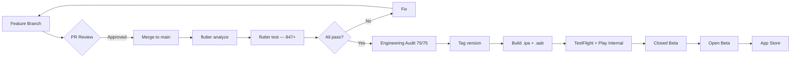

# Release Pipeline

```mermaid
flowchart LR
    A[Feature Branch] --> B{PR Review}
    B -- Approved --> C[Merge to main]
    C --> D[flutter analyze]
    D --> E[flutter test — 847+]
    E --> F{All pass?}
    F -- No --> G[Fix]
    G --> A
    F -- Yes --> H[Engineering Audit 75/75]
    H --> I[Tag version]
    I --> J[Build .ipa + .aab]
    J --> K[TestFlight + Play Internal]
    K --> L[Closed Beta]
    L --> M[Open Beta]
    M --> N[App Store]
```
