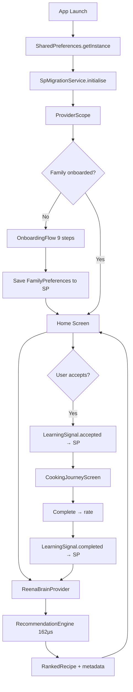

# System Flow

```mermaid
flowchart TD
    A[App Launch] --> B[SharedPreferences.getInstance]
    B --> C[SpMigrationService.initialise]
    C --> D[ProviderScope]
    D --> E{Family onboarded?}
    E -- No --> F[OnboardingFlow 9 steps]
    F --> G[Save FamilyPreferences to SP]
    G --> H[Home Screen]
    E -- Yes --> H
    H --> I[ReenaBrainProvider]
    I --> J[RecommendationEngine 162µs]
    J --> K[RankedRecipe + metadata]
    K --> H
    H --> L{User accepts?}
    L -- Yes --> M[LearningSignal.accepted → SP]
    M --> N[CookingJourneyScreen]
    N --> O[Complete → rate]
    O --> P[LearningSignal.completed → SP]
    P --> I
```
